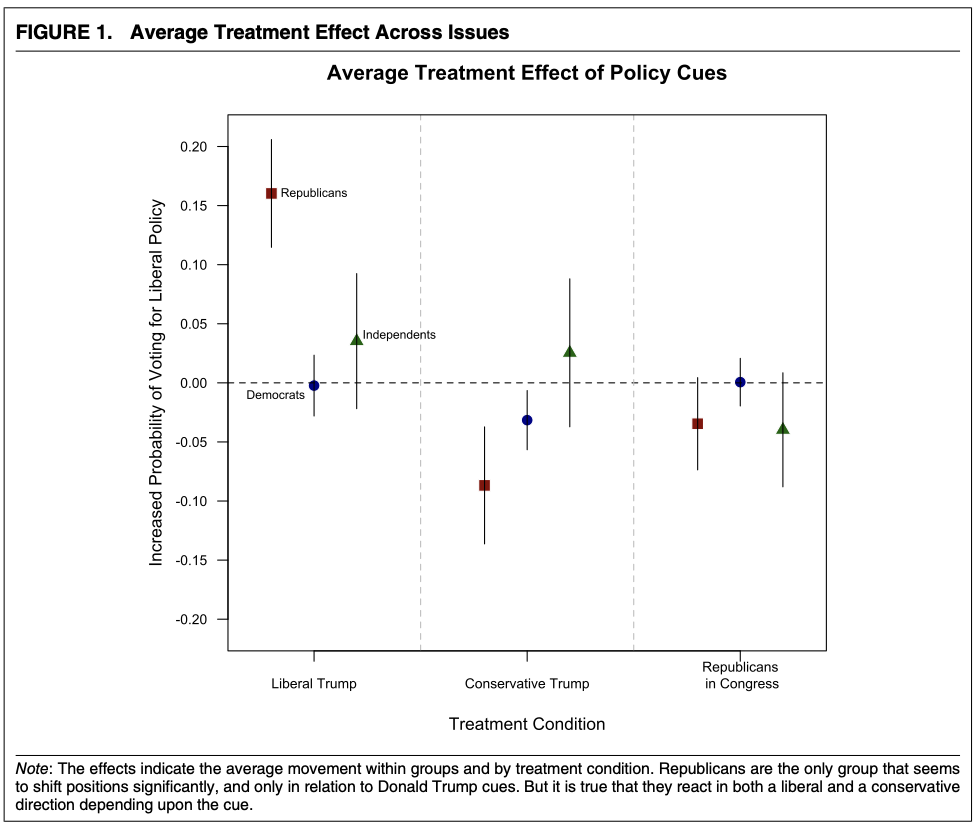
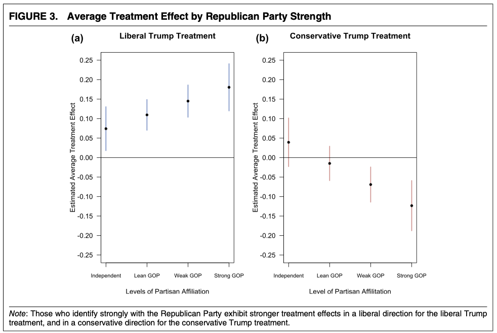

```{r setup, include=FALSE}
knitr::opts_chunk$set(echo = FALSE, message = FALSE)
#knitr::write_bib("bib.bib", width = 60)
library(foreign)
library(readstata13)
library(tidyverse)
library(stargazer)
library(jtools)
library(ggstance)
library(rstanarm)
#Please cite as: 
# Hlavac, Marek (2018). stargazer: Well-Formatted Regression and Summary Statistics Tables.
# R package version 5.2.2. https://CRAN.R-project.org/package=stargazer 
```

```{r process data}
library(foreign)
library(readstata13)
data <- read.dta13("Ideology_Trump.dta")
mturk <- read.csv("Trump_Obama.csv")
```

# Abstract
Barber and Pope (2018) show that the electorate is more influenced by party position than real ideology. The results of the paper and the replication indicate that party loyalists vote in line with their leader, regarless of the political content of their leader's cues. More specifically, voters with low political knowledge, high partisanship, and high approval of their leader are more likely to support their leader's cues, regardless of the true ideological implications, even if they are not in line with the party's traditional views. I looked at Barber and Pope's regressions testing the causal effect of conservative and liberal cues from President Trump on Republican, Democrats, and Independents with varying levels of political knowledge, partisanship, approval of Trump, and political ideology. I took the regression on partisanship and knowledge as well as the overall regression of average cue response among all political identities and ran a more robust binomial regression as well as corrected for a mistake in the first figure of the paper. I found that party loyalists are not necessarily ideological loyalists and, more specifically, that many Republican Trump supporters respond positively to liberal or conservative cues from Trump but not necessarily from others. This finding forces Americans to rethink the importance of parties and the ideological strength of their positions. 
\newpage

# Introduction
My replication paper will be looking at Michael Barber and Jeremy C. Pope's paper, "Does Party Trump Ideology? Disentangling Party and Ideology in America" which was published in the American Political Science Review in 2018. The paper tests whether citizens truly use their policy views to choose a partisan affiliation and if they see partisanship as more of a social identity. The paper asks: "how sincerely held are expressed political and policy opinions and are these opinions based on ideological convictions, or group loyalty?".^[1, Barber and Pope] The authors use Trump's unusual presidency to answer these questions. Since President Trump is both the leader of the GOP as well as a president that endorses both liberal and conservative views, the authors test the effect of Trump's political stances on voters' political stances.

The authors' main hypothesis asserts that the influence of President Trump will demonstrate the existence of a large bloc of party loyalists in the electorate when his influence moves opinion in either a liberal or conservative direction based on his political cue. Those who are most likely to be party loyalists have a lack of knowledge about the party's traditional views and a lack of self-proclaimed "symbolic ideological commitment." Their null hypothesis is that Trump's cue haas no effect on subgroups. They have four specific hypotheses that fall under their main hypothesis:
 1. **Knowledge Hypothesis:** Only the those with less knowledge should react to the cue and behave as party loyalists presumably because the knowledgeable gain little from the treatment (political cue).
 2. **Partisan Hypothesis:** Strong party affiliates that share party with the cue-giver are more likely to be party loyalists.
 3. **Approval Hypothesis:** Those who approve of the cue-giver should be more likely to be party loyalists. 
 4. **Symbolic Ideology Hypothesis:** Self-described conservatives should hold firm to their presumed beliefs and are less likely to be party loyalists because they stick with their self-described policy tenets.

These hypotheses are tested by running a variety of regressions on data collected from surveys. Subjects were split into two groups, control and treatment, and asked about 10 political issues with clear partisan positions. The authors chose questions that capture policy issues in which Trump has taken either a conservative stance or a liberal stance. The control group was asked if they agree with a policy. The treatment group was asked if they agree with a policy after being prompted that Trump endorses this policy. Using this data, the authors ran linear regressions, which I replicated using R, that explained subjects' support of policies using their partisanship, approval of the president, political knowledge, and symbolic ideology. ^[R] The authors conclude, and I confirm, that all of their hypotheses hold true except the symbolic ideology hypothesis. They found that people who most strongly described themselves as conservative most strongly answered the Trump cues (both liberal and conservative). I extend this analysis by running binomial regressions which demonstrate more robust relationships. I also correct a mistake in one of the figures from the published paper.

I find that the authors' first three hypotheses are indeed correct - those with lower political knowledge, higher partisanship, and higher approval tend to respond more strongly to a cue-giver, regardless of the ideological basis of the cue. Like the authors, I also conclude that those with higher ideological levels are actually more partisan in their response to cue-givers: even if a fellow partisan cue-giver demonstrates a nontraditional policy position, those with strong self-identfied ideologies are more likely to respond to the cue. These conclusions all point to the fact that parties are becoming more of a social identity and that ideology is being displaced by partisan affinity. This has major implications for the future of the party system and the way that candidates campaign. It seems that they are catering to a social cohort rather than an ideological community. 

All analysis for this paper is available at my Git hub profile and the original data is available on Data verse. ^[https://github.com/carine-h/milestone_5, https://dataverse.harvard.edu/dataset.xhtml?persistentId=doi:10.7910/DVN/38BFML]

# Literature Review 
There is an increasing amount of discussion around the legitimacy of partisan identification in terms of its ideological significance. Barber and Pope are just two of many authors noticing the decline of the ideological salience of partisanship and the populations more susceptible to this phenomenon. Zaller and Feldman (1992), for instance, discuss the weakness of voters' ideological preferences: "Most citizens, we argue, simply do not possess preformed attitudes at the level of specificity demanded in surveys. Rather, they carry around in their heads a mix of only partially consistent ideas and consideration." Rather, they feel that voters operate based on pre-conceived judgements and generalizations. With respect to Barber and Pope's findings, this means that the American electorate uses partisanship and ideology as masks for their own personal notions and prejudices. 

Iyengar and Westwood (2015) mark the rise of party identity in American life, making Barber and Pope's conclusions ever more salient. According to their study, partisan polarization is as strong as racial polarization and has implications on nonpolitical judgements about members of the opposite party. ^[Iyengar] Taken with the Barber and Pope results, this could mean that cue-givers are merely partisan symbols, decreasing the importance of the actual content of their cues. This also reinforces the idea that partisanship. 

# Replication
I was able to replicate the Interactions Models table (Table 1) and Figures 1-5 which test each of the hypotheses in the paper. The only issue I ran into was in Figure 1: Average Treatment Effect of Policy Cues. This table claims that cues from GOP leaders on Republicans make Republicans about 3% less likely to vote liberal. This is not consistent with the outcome of the authors' regression which shows that Republicans were slightly more likely to vote liberally. I believe that this may be a small mistake on the part of the authors.

# Extension
In the extension, I will be addressing a plotting issue in Figure 1, adding sigma and stan_glm to the Figure 1, expanding the test of partisanship to Democrats as well as Republicans on Figure 3, and using stan_glm and its associate prediction functions on Figure 3 as opposed to a linear regression and its linear prediction function. 

## Figure 1: Mistake
To begin, I will address the issue with Figure 1, which I describe above. I have actually already addressed it in the replication done above. Essentially, the regression result is not consisten with the outcome plotted in the graph. This could be an important addition to the findings in the paper - Republicans actually have a very slight aversion to cues from GOP leaders. This deepends the authors' findings that partisan identity may be more of a group identity rather than an ideological marker.

```{r, fig.height = 4, fig.width= 5, fig.align= "center"}

data
# We are looking to see the effect of different cues (liberal, conservative, and conservative from congress) on Republicans, Democrats, and Independents. 
# Regression for average treatment effects of a conservative, liberal, and congression conservative cue among Republicans:
# With each of the regressions, we see data filtered for Republicans:
#conservative treatment
model1 <- lm(Support ~ race_white + contrump, data = data[data$republican == 1 & (data$contrump == 1 | data$self == 1),])
#liberal treatment
model2 <- lm(Support ~ race_white + libtrump, data = data[data$republican == 1 & (data$libtrump == 1 | data$self == 1),])
#GOP treatment
model3 <- lm(support_gop ~ race_white + gopleader, data = data[data$republican == 1 & (data$gopleader == 1 | data$self == 1),])
# ****MISTAKE**** in the paper, figure 1 has the treatment effect of about -0.03 on the conservatives yet the outcome is 0.008
# Regression for average treatment effects of a conservative, liberal, and congression conservative cue among Democrats:
# With each of the regressions, we see data filtered for Democrats:
#conservative treatment
model1dem <- lm(Support ~ race_white + contrump, data = data[data$democrat == 1 & (data$contrump == 1 | data$self == 1),])
#liberal treatment
model2dem <- lm(Support ~ race_white + libtrump, data = data[data$democrat == 1 & (data$libtrump == 1 | data$self == 1),])
#GOP treatment
model3dem <- lm(support_gop ~ race_white + gopleader, data = data[data$democrat == 1 & (data$gopleader == 1 | data$self == 1),])
# Regression for average treatment effects of a conservative, liberal, and congression conservative cue among Independents:
# With each of the regressions, we see data filtered for Independents:
#conservative treatment
model1ind <- lm(Support ~ race_white + contrump, data = data[data$republican == 0 & data$democrat == 0 & (data$contrump == 1 | data$self == 1),])
#liberal treatment
model2ind <- lm(Support ~ race_white + libtrump, data = data[data$republican == 0 & data$democrat == 0 & (data$libtrump == 1 | data$self == 1),])
#GOP treatment
model3ind <- lm(support_gop ~ race_white + gopleader, data = data[data$republican == 0 & data$democrat == 0 & (data$gopleader == 1 | data$self == 1),])
# Here, the authors pull the effect of the conservative cue on each political group: 
conservative.treat <- c(model1$coef[3], model1dem$coef[3], model1ind$coef[3])
# Here's the standard error for the conservative cue's effect on each political group:
conservative.se <- c(coef(summary(model1))[, "Std. Error"][3], coef(summary(model1dem))[, "Std. Error"][3], coef(summary(model1ind))[, "Std. Error"][3])
# This creates confidence intervals for the effect of conservative cues on each group:
lower.cons <- conservative.treat - 1.96*conservative.se
upper.cons <- conservative.treat + 1.96*conservative.se
# Here, the authors pull the effect of the liberal cue on each political group:
liberal.treat <- c(model2$coef[3], model2dem$coef[3], model2ind$coef[3])
# Here's the standard error for the liberal cue's effect on each political group:
liberal.se <- c(coef(summary(model2))[, "Std. Error"][3], coef(summary(model2dem))[, "Std. Error"][3], coef(summary(model2ind))[, "Std. Error"][3])
# This creates confidence intervals for the effect of liberal cues on each group:
lower.liberal <- liberal.treat - 1.96*liberal.se
upper.liberal <- liberal.treat + 1.96*liberal.se
# Here, the authors pull the effect of the GOP congressional cue on each political group:
gop.treat <- c(model3$coef[3], model3dem$coef[3], model3ind$coef[3])
# Here's the standard error for the GOP congressional cue effect on each political group:
gop.se <- c(coef(summary(model3))[, "Std. Error"][3], coef(summary(model3dem))[, "Std. Error"][3], coef(summary(model3ind))[, "Std. Error"][3])
# This creates confidence intervals for the effect of the GOP congressional cue on each group:
lower.gop <- gop.treat - 1.96*gop.se
upper.gop <- gop.treat + 1.96*gop.se
# This standardizes the spacing and divisions in the figure
a <- c(.8, 1, 1.2)
# I deleted this portion becauase it "mutes" the figure
#dev.off()
# This plots the corresponding coefficients
plot(a, liberal.treat, pch = c(15, 16, 17), axes = F, xlab = "Treatment Condition", ylab = "Increased Probability of Voting for Liberal Policy", ylim = c(-.21, .21), col  = c("dark red", "dark blue", "dark green"), xlim = c(.7, 3.3), cex = 1.5, main = "Average Treatment Effect of Policy Cues")
segments(x0 = a, y0 = lower.liberal, x1 = a, y1 = upper.liberal)
points(a+1, conservative.treat, pch = c(15, 16, 17), col  = c("dark red", "dark blue", "dark green"), cex = 1.5)
segments(x0 = a+1, y0 = lower.cons, x1 = a+1, y1 = upper.cons)
points(a+2, gop.treat, pch = c(15, 16, 17), col  = c("dark red", "dark blue", "dark green"), cex = 1.5)
segments(x0 = a+2, y0 = lower.gop, x1 = a+2, y1 = upper.gop)
# x-axis labels
axis(1, at = c(1,2,3), labels = c("Liberal Trump", "Conservative Trump", "Republicans\n in Congress"), cex.axis = .8)
axis(2, at = seq(-.2, .2, .05), las = 2, cex.axis = .8)
# dashled lines 
abline(h = 0, lty = 2)
abline(v = seq(1.5, 3.5, 1), lty = 2, col = "grey")
# This labels the points in the first panel
text(2.8,.28, "comparison group is no cue")
text(1, .16, "Republicans", cex = .7)
text(.82, -.01, "Democrats", cex = .7)
text(1.4, .04, "Independents", cex = .7)
box()

# dir.create("pictures")
```
<br>


I found one mistake - the cofficient for Republicans in Congress on the Republican subset is displayed as about -0.03 probability of voting for liberal policy while the regression tells us that it is actually about 0.008. I correct this in my figure. 

## Figure 3: Average Treatment Effect by Party strength among Democrats 
```{r, fig.height = 4, fig.width= 6.5, fig.align= "center"}
# FIGURE 3 EXTENSION 1 
# EXTENSION: TESTING FIGURE THREE WITH DEMOCRATS (ID= 1-4)
# This code will culminate in plot that looks at the treatment effect (political cue) on those with varying partisan affiliation. 
# The hypothesis here states: Strong party affiliates that share party with the cue-giver are more likely to be party loyalists.
# This model is the basis of the predictions and will help determine the causal effect of political cues on different levels of partisanship among DEMOCRATS. This model estimates support of policy based on race and the interaction between cues (conservative and liberal) and political ideology:
model1 <- lm(Support ~ race_white + libtrump*pid7 + contrump*pid7, data = data[(data$contrump == 1 | data$self == 1 | data$libtrump == 1) & data$pid7 %in% c(1, 2, 3, 4),])
# This data table serves as the control - the baseline for comparison. There is no cue in this data table:
newdata = as.data.frame(cbind(rep(1, 4), rep(0, 4), rep(0, 4), seq(4, 7, 1)))
colnames(newdata) <- c("race_white", "contrump", "libtrump", "pid7")
#conservative treatment: The effect of a conservative cue on those who identify with a conservative party at different degrees (pid7 = 4-7)
newdata1 = as.data.frame(cbind(rep(1, 4), rep(1, 4), rep(0, 4), seq(4, 7, 1)))
colnames(newdata1) <- c("race_white", "contrump", "libtrump", "pid7")
# These are predictions of the level of support at each Republican partisan level given the data table above with no cue:
plx0 <- predict(model1, newdata = newdata, type = "response", se = T)
#These are predictions of the level of support of a cue at each Republican partisan level given a conservative cue:
plx1 <- predict(model1, newdata = newdata1, type = "response", se = T)
# This estimates the causal effect of cues on different levels of Republican partisanship:
diff.cons <- plx1$fit - plx0$fit
# This is the staandard error of the estimates causal effects:
diff.cons.se <- sqrt(plx1$se.fit^2 + plx0$se.fit^2)
# These are the upper and lower confidence intervals the causal effect. They are calculated by adding and subtract a standard deviation times the standard error calculated above:
# IS THIS A CONF INTERVAL, 95%?, 65%?:
upper.cons <- diff.cons + 1.96*diff.cons.se
lower.cons <- diff.cons - 1.96*diff.cons.se
# plots next to each other
par(mfrow = c(1, 2)) 
# This chunk plots the causal effects the same way that figure 2 did, but with partisanship on the x-axis:
#dev.new(width = 4.5, height = 7)
plot(seq(4, 7, 1), diff.cons, ylim = c(-.25, .25), pch = 16, ylab = "Estimated Average Treatment Effect", xlab = "Level of Partisan Affilitation", axes = F, main = "Conservative Trump Treatment")
segments(x0 = c(seq(4, 7, 1), x1 = seq(4, 7, 1)), y0 = lower.cons, y1 = upper.cons, col = "#d17b7b80", lwd = 2)
points(seq(4, 7, 1), diff.cons, pch = 16)
abline(h = 0)
# changed titles to match change in id
axis(1, at = seq(4, 7, 1), labels = c("Independent", "Lean DEM", "Weak DEM", "Strong DEM"), cex.axis = .8)
axis(2, at = seq(-.45, .25, .05), las = 2)
box()
# The same steps as above are repeated here, but using the liberal cue as treatment on Republican partisans:
newdata1 = as.data.frame(cbind(rep(1, 4), rep(1, 4), rep(0, 4), rep(0, 4), rep(1, 4), seq(4, 7, 1)))
colnames(newdata1) <- c("race_white", "republican", "democrat", "contrump", "libtrump", "pid7")
# Like above, these are the predictions for the control and for the treatment:
plx0 <- predict(model1, newdata = newdata, type = "response", se = T)
plx1 <- predict(model1, newdata = newdata1, type = "response", se = T)
# Here we calculate the causal effect and the standard error:
diff.lib <- plx1$fit - plx0$fit
diff.lib.se <- sqrt(plx1$se.fit^2 + plx0$se.fit^2)
# These are the upper and lower confidence intervals:
upper.lib <- diff.lib + 1.96*diff.lib.se
lower.lib <- diff.lib - 1.96*diff.lib.se
# Here is the plot:
#dev.new(width = 4.5, height = 7)
plot(seq(4, 7, 1), diff.lib, ylim = c(-.25, .25), pch = 16, ylab = "Estimated Average Treatment Effect", xlab = "Levels of Partisan Affiliation", axes = F, main = "Liberal Trump Treatment")
segments(x0 = c(seq(4, 7, 1), x1 = seq(4, 7, 1)), y0 = lower.lib, y1 = upper.lib, col = "#4286f480", lwd = 2)
points(seq(4, 7, 1), diff.lib, pch = 16)
abline(h = 0)
# changed titles to match change in id
axis(1, at = seq(4, 7, 1), labels = c("Independent", "Lean DEM", "Weak DEM", "Strong DEM"), cex.axis = .8)
axis(2, at = seq(-.25, .45, .05), las = 2)
box()

# NOTES: SHOWS HARDLY ANY EFFECT, CONSERVATIVE CUE HAS IMPACT ON STRONG LIB - MAKES MORE LIKELY TO VOTE LIB 
```
<br>



In order to see if the relationship between political cues and partisanship is only exclusive to Republicans, I would like to run a similar model on partisanship levels among Democrats. This would mean repeating the steps done in Figure 3, but testing the cue's effects on partisanship levels from 1-4 (very Democrat to Independent). I predict that there will be a different effect given the fact that Democrats would be answering cues from Trump. Therefore, I expect there to be some sort of aversionary effect: even if Trump advocates a liberal policy, they will support it less than their Republican counterpoints at the same level of partisanship just because the cue is from the a Republican leader (especially one as polarizing as Trump). 

The results show that Democrats of different partisan levels (Independent to strong Democrat) do not respond significantly to conservative or liberal Trump cues. There is an interesting trend among different levels of Democrats when given a conservative cue: as partisanship becomes more Democrat, Democrats are more and more likely to vote liberally when given a conservative cue. It is important to note, however, that uncertainty is greatest at the strongest lebel of Democrat. Liberal cues, however, have almost no effect on different levels of partisanship to the left. 

# Figure 2: Binomial Regression instead of Linear 
Finally, I want to take figure 2 and see if I can create a more robust model. These regression models are currently linear and use interactions to predict the outcome of a cue given something like partisanship, ideology, etc. The authors then use the predict function to predict support of a policy and to find the causal effect of recieving a cue by subtracting the response outcome for the treated from a fake data set of untreated individuals. I believe that by using a binomial regression and the posterior_linpred function, I could create a more robust model and prediction, thus achieving a more accurate causal effect. (I would compare these two models with LOO as well as using standard errors and sigma.)

The only downside of this method is the fact that posterior_linpred does not give an uncertainty measure for each of its estimates while predict yields standard error. That is the reason there are no uncertainty measures on the graph. 
```{r, fig.height = 4, fig.width= 6.5, fig.align= "center"}
# FIGURE 2 EXTENSION

# This code will culminate in plot that looks at the treatment effect (political cue) on those with varying political knowledge. # The hypothesis here states: Only the those with less knowledge should react to the cue and behave as party loyalists presumably because the knowledgeable gain little from the treatment (political cue).
# Model 1 is a linear regression that looks that the impact of political knowledge on response to cues. The authors include an interaction between liberal cues and knowledge as well as conservative cues and knowledge to see if there is any discrepancy between cues' effects with knowledge:
modelstan <- stan_glm(Support ~ race_white + libtrump*knowledge + contrump*knowledge, data = data[(data$contrump == 1 | data$self == 1 | data$libtrump == 1),], refresh = 0, family = "binomial")

# Now we are looking at the liberal cue's causal effect at each interval of knowledge:
#control: there is no cue in this data table
newdata = as.data.frame(cbind(rep(1, 9), rep(0, 9), rep(0, 9), seq(0, 8, 1)))
colnames(newdata) <- c("race_white", "contrump", "libtrump", "knowledge")
# This data frame designates the liberal cue for each level of knowledge:
newdata1 = as.data.frame(cbind(rep(1, 9), rep(0, 9), rep(1,9), seq(0, 8, 1)))
colnames(newdata1) <- c("race_white", "contrump", "libtrump", "knowledge")
# This table predicts the response at each level of knowledge given no cue.
plx0 <- posterior_linpred(modelstan, newdata = newdata, transfor = TRUE)
# This table predicts the response at each level of knowledge given a liberal cue.
plx1 <- posterior_linpred(modelstan, newdata = newdata1, transform = TRUE)
# This is the treatment effect: the difference between response at each knowledge level with a liberal cue and a response at teach knowledge level with a cue. It is the causal effect of the liberal treatment.
diff.l <- plx1 - plx0
diff.lib <- colMeans(diff.l)
# I will use the 95% credible interval to create an uncertainty measure:
# DO YOU TAKE QUANTILE OF DIFFERENCE OR JUST ONE 

k0ci25l <- quantile(diff.l[,1], 0.025)
k1ci25l <- quantile(diff.l[,2], 0.025)
k2ci25l <- quantile(diff.l[,3], 0.025)
k3ci25l <- quantile(diff.l[,4], 0.025)
k4ci25l <- quantile(diff.l[,5], 0.025)
k5ci25l <- quantile(diff.l[,6], 0.025)
k6ci25l <- quantile(diff.l[,7], 0.025)
k7ci25l <- quantile(diff.l[,8], 0.025)
k8ci25l <- quantile(diff.l[,9], 0.025)

k0ci95l <- quantile(diff.l[,1], 0.975)
k1ci95l <- quantile(diff.l[,2], 0.975)
k2ci95l <- quantile(diff.l[,3], 0.975)
k3ci95l <- quantile(diff.l[,4], 0.975)
k4ci95l <- quantile(diff.l[,5], 0.975)
k5ci95l <- quantile(diff.l[,6], 0.975)
k6ci95l <- quantile(diff.l[,7], 0.975)
k7ci95l <- quantile(diff.l[,8], 0.975)
k8ci95l <- quantile(diff.l[,9], 0.975)

# These are the upper and lower credible levels that will be plotted:
upper.lib <- c(k0ci95l, k1ci95l, k2ci95l, k3ci95l, k4ci95l, k5ci95l, k6ci95l, k7ci95l, k8ci95l)
lower.lib <- c(k0ci25l, k1ci25l, k2ci25l, k3ci25l, k4ci25l, k5ci25l, k6ci25l, k7ci25l, k8ci25l)

# will put plots together
par(mfrow = c(1, 2)) 
    
# the plotting here is the SAME as above
#dev.new(width = 4.5, height = 7)
plot(seq(0, 8, 1), diff.lib, ylim = c(-.25, .15), pch = 16, ylab = "Estimated Average Treatment Effect", xlab = "Level of Political Knowledge", axes = F, main = "Liberal Trump Treatment")
segments(x0 = c(seq(0, 8, 1), x1 = seq(0, 8, 1)), y0 = lower.lib, y1 = upper.lib, col = "#4286f480", lwd = 2)
points(seq(0, 8, 1), diff.lib, pch = 16)
abline(h = 0)
axis(1, at = seq(0, 8, 1))
axis(2, at = seq(-.25, .15, .05), las = 2)
box()


# Looking at the conservative cue's impact on each level of knowledge:
#conservative treatment: this data table contains a conservative cue for each level of knowledge
newdata1 = as.data.frame(cbind(rep(1, 9), rep(1, 9), rep(0,9), seq(0, 8, 1)))
colnames(newdata1) <- c("race_white", "contrump", "libtrump", "knowledge")
# This table predicts the response at each level of knowledge given no cue.
plx0 <- posterior_linpred(modelstan, newdata = newdata, type = "response", transform = TRUE, se = T)
# This table predicts the response at each level of knowledge given a conservative cue.
plx1 <- posterior_linpred(modelstan, newdata = newdata1, type = "response", transform = TRUE, se = T)
# NOT REALLY SURE WHY THE MODEL1 IS USED IN FIRST PREDICT - WHAT DOES PLX0 DO?
# This is the treatment effect: the difference between response at each knowledge level with a conservative cue and a response at teach knowledge level with a cue. It is the causal effect of the conservative treatment.
diff <- plx1 - plx0
diff.cons <- colMeans(diff)
# I will use the 95% credible interval to create an uncertainty measure:
# DO YOU TAKE QUANTILE OF DIFFERENCE OR JUST ONE 

k0ci25 <- quantile(diff[,1], 0.025)
k1ci25 <- quantile(diff[,2], 0.025)
k2ci25 <- quantile(diff[,3], 0.025)
k3ci25 <- quantile(diff[,4], 0.025)
k4ci25 <- quantile(diff[,5], 0.025)
k5ci25 <- quantile(diff[,6], 0.025)
k6ci25 <- quantile(diff[,7], 0.025)
k7ci25 <- quantile(diff[,8], 0.025)
k8ci25 <- quantile(diff[,9], 0.025)

k0ci95 <- quantile(diff[,1], 0.975)
k1ci95 <- quantile(diff[,2], 0.975)
k2ci95 <- quantile(diff[,3], 0.975)
k3ci95 <- quantile(diff[,4], 0.975)
k4ci95 <- quantile(diff[,5], 0.975)
k5ci95 <- quantile(diff[,6], 0.975)
k6ci95 <- quantile(diff[,7], 0.975)
k7ci95 <- quantile(diff[,8], 0.975)
k8ci95 <- quantile(diff[,9], 0.975)

# These are the upper and lower credible levels that will be plotted:
upper.cons <- c(k0ci95, k1ci95, k2ci95, k3ci95, k4ci95, k5ci95, k6ci95, k7ci95, k8ci95)
lower.cons <- c(k0ci25, k1ci25, k2ci25, k3ci25, k4ci25, k5ci25, k6ci25, k7ci25, k8ci25)

# This plots the diff.cons (the causal effect of a conservative cue at each level of knowledge) with the upper and lower confidence intervals crafted with the standard error. The function also gives the range of the plots, the titles, and the axes. 
# These are just the points, titles, and axes:
plot(seq(0, 8, 1), diff.cons, ylim = c(-.25, .15), pch = 16, ylab = "Estimated Average Treatment Effect", xlab = "Level of Political Knowledge", axes = F, main = "Conservative Trump Treatment")
#This adds on the upper and lower confidence intervals showing the uncertainty of the estimate. It also designates the color of the bars denoting uncertainty:
segments(x0 = c(seq(0, 8, 1), x1 = seq(0, 8, 1)), y0 = lower.cons, y1 = upper.cons, col = "#d17b7b80", lwd = 2)
# This brings the points back in front of the lines of uncertainty:
points(seq(0, 8, 1), diff.cons, pch = 16)
abline(h = 0)
# This adds an axis at zero:
axis(1, at = seq(0, 8, 1))
# This adds the y-axis and denotes the range:
axis(2, at = seq(-.25, .15, .05), las = 2)
# This puts a border around the plot:
box()


```


# Bibliography


